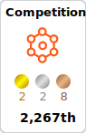
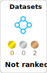
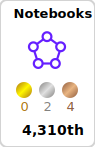

# Hi there! 👋

I'm **Bruno Bianchi**, a passionate programmer pursuing a degree in **Computer Engineering** at [Universidade Federal de Itajubá (UNIFEI)](https://www.unifei.edu.br). 🚀

## About Me

I’m  actively working on a **Research & Development (R&D) project** for **Vertis**, focused on developing an **automated mobile network monitoring solution**. This project leverages **Artificial Intelligence (AI)** methods to optimize and improve network performance, providing real-time monitoring and analysis.

I also have a strong passion for technology, programming, and solving complex challenges. My journey in the tech world began over seven years ago, and I've since gained expertise in:

- **Languages**: TypeScript, JavaScript, Java, Python, R, Haskell
- **Back-End**: Node.js, Nest.js, Prisma, MongoDB, PostgreSQL, Firebase
- **Front-End**: Angular
- **Tools**: VS Code, Git

I’m always eager to explore new technologies, improve my skills, and contribute to innovative projects.

  
 
  
  

 <!--START_SECTION:waka-->

```txt
From: 22 August 2024 - To: 30 December 2024

Total Time: 70 hrs 58 mins

Python       28 hrs 50 mins  ⣿⣿⣿⣿⣿⣿⣿⣿⣿⣿⣄⣀⣀⣀⣀⣀⣀⣀⣀⣀⣀⣀⣀⣀⣀   40.59 %
Java         10 hrs 3 mins   ⣿⣿⣿⣦⣀⣀⣀⣀⣀⣀⣀⣀⣀⣀⣀⣀⣀⣀⣀⣀⣀⣀⣀⣀⣀   14.16 %
R            9 hrs 18 mins   ⣿⣿⣿⣤⣀⣀⣀⣀⣀⣀⣀⣀⣀⣀⣀⣀⣀⣀⣀⣀⣀⣀⣀⣀⣀   13.10 %
JavaScript   7 hrs 35 mins   ⣿⣿⣶⣀⣀⣀⣀⣀⣀⣀⣀⣀⣀⣀⣀⣀⣀⣀⣀⣀⣀⣀⣀⣀⣀   10.69 %
TypeScript   3 hrs 58 mins   ⣿⣤⣀⣀⣀⣀⣀⣀⣀⣀⣀⣀⣀⣀⣀⣀⣀⣀⣀⣀⣀⣀⣀⣀⣀   05.59 %
Text         1 hr 2 mins     ⣤⣀⣀⣀⣀⣀⣀⣀⣀⣀⣀⣀⣀⣀⣀⣀⣀⣀⣀⣀⣀⣀⣀⣀⣀   01.48 %
Bash         27 mins         ⣄⣀⣀⣀⣀⣀⣀⣀⣀⣀⣀⣀⣀⣀⣀⣀⣀⣀⣀⣀⣀⣀⣀⣀⣀   00.64 %
```

<!--END_SECTION:waka-->

<div>
  
</div>


