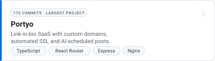
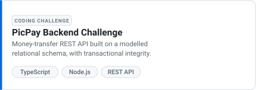
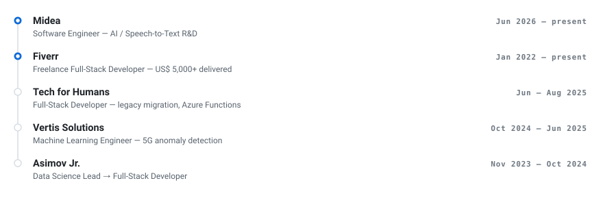

<div align="center">

# Bruno Bianchi

### Full-Stack Developer · Node.js · React · TypeScript · Python

Computer Engineering student at **UNIFEI** · Building web products end-to-end, from requirements to deploy.

[](https://brunobianchi.dev)
[](https://www.linkedin.com/in/brunorbianchi)
[](mailto:contato@brunobianchi.dev)

</div>

---

## About

Full-Stack Developer with **4 years building digital products** across fintech, edtech, industry and applied AI — from requirements gathering to production deploy.

I work across the whole cycle: data modeling, REST APIs, service integration, component-based React interfaces and cloud deployment. Hands-on with microservices, serverless functions, Docker containers and CI/CD, with attention to clean code, performance and scalability.

- 🏢 **Software Engineer @ Midea** — R&D speech-to-text + AI analysis POC (UNIFEI × Midea Carrier partnership)
- 🎓 **Computer Engineering @ UNIFEI** — graduating Dec/2027
- 🇧🇷 **Google Student Ambassador 2026** — Gemini and generative AI
- ☁️ **Linux Foundation (LiFT) scholar** — training toward CKAD
- 🏆 **2× hackathon winner** — TechLab 2025 and Hackathon Ninja 2026
- 💼 Open to **internship / junior Full-Stack roles**, remote or hybrid

---

## Featured Projects

<a href="https://github.com/BrunoBianchi/Tech4Um-Grupo02"></a>

<a href="https://github.com/BrunoBianchi/Tech4Humans-Webapp-Financa"></a>

<a href="https://github.com/BrunoBianchi/Portyo"></a>

<a href="https://github.com/BrunoBianchi/Google-Students-Embassador"></a>

<a href="https://github.com/BrunoBianchi/midea-speech-to-text"></a>

<a href="https://github.com/BrunoBianchi/picpay-backend-challenge"></a>

---

## Experience



---

## Tech Stack

**Backend**


**Frontend**


**Data & Cloud**


**Practices** — Clean Code · Clean Architecture · SOLID · REST API design · Code Review · Scrum

---

## Certifications


Backend System Design · Foundations of Coding Full-Stack · Introduction to Front-End Development

---

## Coding Activity

<!--START_SECTION:waka-->

```txt
From: 22 August 2024 - To: 29 August 2026

Total Time: 629 hrs 41 mins

TypeScript                         322 hrs 26 mins       ⣿⣿⣿⣿⣿⣿⣿⣿⣿⣿⣿⣿⣶⣀⣀⣀⣀⣀⣀⣀⣀⣀⣀⣀⣀   50.78 %
Python                             101 hrs 37 mins       ⣿⣿⣿⣿⣀⣀⣀⣀⣀⣀⣀⣀⣀⣀⣀⣀⣀⣀⣀⣀⣀⣀⣀⣀⣀   16.00 %
JavaScript                         33 hrs 43 mins        ⣿⣤⣀⣀⣀⣀⣀⣀⣀⣀⣀⣀⣀⣀⣀⣀⣀⣀⣀⣀⣀⣀⣀⣀⣀   05.31 %
Markdown                           25 hrs 3 mins         ⣿⣀⣀⣀⣀⣀⣀⣀⣀⣀⣀⣀⣀⣀⣀⣀⣀⣀⣀⣀⣀⣀⣀⣀⣀   03.95 %
Bash                               15 hrs 35 mins        ⣶⣀⣀⣀⣀⣀⣀⣀⣀⣀⣀⣀⣀⣀⣀⣀⣀⣀⣀⣀⣀⣀⣀⣀⣀   02.46 %
Java                               11 hrs 18 mins        ⣦⣀⣀⣀⣀⣀⣀⣀⣀⣀⣀⣀⣀⣀⣀⣀⣀⣀⣀⣀⣀⣀⣀⣀⣀   01.78 %
R                                  9 hrs 21 mins         ⣤⣀⣀⣀⣀⣀⣀⣀⣀⣀⣀⣀⣀⣀⣀⣀⣀⣀⣀⣀⣀⣀⣀⣀⣀   01.47 %
```

<!--END_SECTION:waka-->

---

<details>
<summary><b>🇧🇷 Versão em português</b></summary>

<br>

**Desenvolvedor Full-Stack** e estudante de Engenharia de Computação na UNIFEI, com **4 anos construindo produtos digitais** do levantamento de requisitos ao deploy, em fintech, edtech, indústria e Inteligência Artificial aplicada.

Atuo no ciclo completo: modelagem de dados, construção de APIs REST, integração entre serviços, interfaces componentizadas em React e deploy em nuvem. Experiência prática com microsserviços, funções serverless, containers Docker e CI/CD, com atenção a código limpo, performance e escalabilidade.

**Principais resultados**

- Arquitetei o MVP do **Tech4Um**, plataforma de fórum e mensageria em tempo real — **1º lugar no Hackathon Ninja 2026**.
- Desenvolvi o **TechFinance**, WebApp de gestão financeira — **1º lugar no TechLab 2025** da Tech4Humans.
- Construí o **Portyo**, SaaS multi-tenant de link-in-bio com domínios personalizados, SSL automatizado e geração de conteúdo por IA.
- Migrei funcionalidades legadas da **Tech for Humans** para arquitetura componentizada com microsserviços e Azure Functions.
- Construí pipelines em Python que alimentam modelos de detecção antecipada de anomalias em **redes 5G** (P&D UNIFEI).
- Gerei **mais de US$ 5.000** como freelancer na Fiverr, com aplicações web, bots e landing pages em React e Tailwind CSS.
- Estruturei do zero a área de **Ciência de Dados da Asimov Jr.**, mentorando a equipe em Python e R.

**Busco estágio ou vaga júnior como Desenvolvedor Full-Stack**, remoto ou híbrido, em times que valorizem qualidade de código, arquitetura sólida e produtos com impacto real.

📫 **Contato:** [contato@brunobianchi.dev](mailto:contato@brunobianchi.dev) · [LinkedIn](https://www.linkedin.com/in/brunorbianchi) · [brunobianchi.dev](https://brunobianchi.dev)

</details>

<div align="center">

<br>

**Looking for a Full-Stack Developer?** I'm open to internship and junior roles — remote or hybrid.

[](mailto:contato@brunobianchi.dev)

</div>
