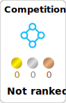

# Hi there! 👋

I'm **Bruno Bianchi**, a passionate programmer pursuing a degree in **Computer Engineering** at [Universidade Federal de Itajubá (UNIFEI)](https://www.unifei.edu.br). 🚀

## About Me

I’m  actively working on a **Research & Development (R&D) project** for **Vertis**, focused on developing an **automated mobile network monitoring solution**. This project leverages **Artificial Intelligence (AI)** methods to optimize and improve network performance, providing real-time monitoring and analysis.

I also have a strong passion for technology, programming, and solving complex challenges. My journey in the tech world began over seven years ago, and I've since gained expertise in:

- **Languages**: TypeScript, JavaScript, Java, Python, R, Haskell
- **Back-End**: Node.js, Nest.js, Prisma, MongoDB, PostgreSQL, Firebase
- **Front-End**: Angular
- **Tools**: VS Code, Git

I’m always eager to explore new technologies, improve my skills, and contribute to innovative projects.

  
 
  
  

 <!--START_SECTION:waka-->

```txt
From: 22 August 2024 - To: 08 June 2025

Total Time: 368 hrs 53 mins

TypeScript     152 hrs 9 mins  ⣿⣿⣿⣿⣿⣿⣿⣿⣿⣿⣤⣀⣀⣀⣀⣀⣀⣀⣀⣀⣀⣀⣀⣀⣀   41.12 %
Python         92 hrs 14 mins  ⣿⣿⣿⣿⣿⣿⣄⣀⣀⣀⣀⣀⣀⣀⣀⣀⣀⣀⣀⣀⣀⣀⣀⣀⣀   24.93 %
JavaScript     13 hrs 38 mins  ⣿⣀⣀⣀⣀⣀⣀⣀⣀⣀⣀⣀⣀⣀⣀⣀⣀⣀⣀⣀⣀⣀⣀⣀⣀   03.69 %
Java           10 hrs 36 mins  ⣶⣀⣀⣀⣀⣀⣀⣀⣀⣀⣀⣀⣀⣀⣀⣀⣀⣀⣀⣀⣀⣀⣀⣀⣀   02.87 %
R              9 hrs 21 mins   ⣶⣀⣀⣀⣀⣀⣀⣀⣀⣀⣀⣀⣀⣀⣀⣀⣀⣀⣀⣀⣀⣀⣀⣀⣀   02.53 %
Markdown       5 hrs 9 mins    ⣤⣀⣀⣀⣀⣀⣀⣀⣀⣀⣀⣀⣀⣀⣀⣀⣀⣀⣀⣀⣀⣀⣀⣀⣀   01.39 %
Text           4 hrs 17 mins   ⣤⣀⣀⣀⣀⣀⣀⣀⣀⣀⣀⣀⣀⣀⣀⣀⣀⣀⣀⣀⣀⣀⣀⣀⣀   01.16 %
```

<!--END_SECTION:waka-->

<div>
  
</div>


